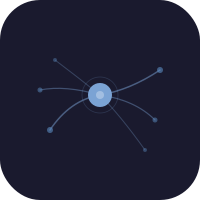

# Polaris

<p align="center">
  
</p>

<p align="center">
  <strong>Stimolazione cognitiva con intelligenza artificiale</strong>
</p>

---

Polaris is an Android app for cognitive stimulation exercises powered by Google Gemini AI. It guides users through interactive voice-based sessions covering memory, attention, verbal fluency, and numerical sequences.

## Features

- **4 Exercise Types**: Memory (article comprehension), Attention (hidden words), Verbal Fluency (timed word generation), Number Lists (sequence recall)
- **Voice Interaction**: Full hands-free operation with speech-to-text and text-to-speech
- **AI-Powered**: Exercises generated dynamically by Gemini AI, with conversational guidance
- **Adaptive Difficulty**: Configurable difficulty level from 1 to 10
- **Accessibility**: Large touch targets, text highlighting during TTS reading, auto-scroll
- **Email Reports**: Session results can be sent via email
- **Light/Dark Theme**: Supports automatic, light, and dark themes

## Tech Stack

- **Flutter** (Dart) - Cross-platform UI
- **Google Gemini API** (`google_generative_ai`) - Exercise generation and conversation
- **speech_to_text** - Voice input (Italian)
- **flutter_tts** - Text-to-speech with word-by-word progress tracking
- **Provider** - State management
- **SharedPreferences** - Local settings persistence

## Project Structure

```
lib/
├── main.dart              # Entry point
├── app.dart               # MaterialApp with theme configuration
├── config/
│   ├── app_config.dart    # App constants
│   ├── api_keys.dart      # API keys (gitignored)
│   └── api_keys.example.dart  # API keys template
├── models/
│   └── exercise.dart      # Exercise data models
├── services/
│   ├── gemini_service.dart      # Exercise generation
│   ├── gemini_live_service.dart # Conversational AI
│   ├── speech_service.dart      # STT + TTS
│   └── email_service.dart       # Email reports
├── providers/
│   ├── exercise_provider.dart   # Session state management
│   └── settings_provider.dart   # App settings
├── screens/
│   ├── home_screen.dart         # Main menu with logo
│   ├── session_screen.dart      # Exercise session UI
│   ├── settings_screen.dart     # Configuration
│   └── results_screen.dart      # Session summary
└── widgets/
    ├── polaris_logo.dart        # Neuron logo (CustomPainter)
    ├── exercise_card.dart
    ├── voice_button.dart
    └── progress_indicator.dart
```

## Setup

1. Clone the repository
2. Run `flutter create .` to generate platform boilerplate
3. **Configure your Gemini API key:**
   ```bash
   cp lib/config/api_keys.example.dart lib/config/api_keys.dart
   ```
   Then edit `lib/config/api_keys.dart` and replace `YOUR_GEMINI_API_KEY_HERE` with your actual [Google Gemini API key](https://aistudio.google.com/apikey).
4. Run `flutter run` to build and launch on a connected Android device

> **Note:** The file `lib/config/api_keys.dart` is listed in `.gitignore` and will never be committed. Each developer must create their own copy from the example template.

## Logo

The Polaris logo represents a stylized neuron with flowing dendrites and synapse endpoints, symbolizing the neural connections that cognitive exercises help strengthen. The design uses a minimal, clean aesthetic in shades of blue.

## License

All rights reserved.
